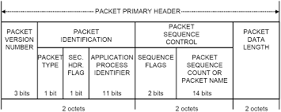

Telemetry Dictionary Introduction
=================================

AIT provides support for YAML-based configuration of telemetry data within the system. AIT uses a YAML based configuration file to define Packets and their constituent Fields.

.. code-block:: yaml

    - !Packet
      name: CCSDS_HEADER
      fields:
        - !Field
          name:       version
          desc:       Indicates CCSDS Version-1 (does not change)
          bytes:       0
          type:       U8
          mask:       0xE0
        - !Field
          name:       type
          desc:       |
            Distinguishes between core and payload packet types to extend the
            APID space to 4032
          bytes:       0
          type:       U8
          mask:       0x10
          enum:
            0: 'Core'
            1: 'Payload'

All the valid parameters and attributes that can be present in the telemetry dictionary definition are defined in the telemetry schema file. By default this is called *tlm_schema.json* and is located in **ait/core/data/**.  AIT also provides a command line utility for verifying that your telemetry dictionary configuration is valid given that you have a defined schema file. If you pass the ``--tlm`` or ``-t`` flag to ``ait-yaml-validate`` it will check this for you.

.. code-block:: bash

    $ ait-yaml-validate --tlm
    016-07-27T09:36:21.408 | INFO     | Validation: SUCCESS: ...

AIT provides telemetry dictionary processing via :class:`ait.core.tlm.TlmDict` which gives a mapping of Packet names and :class:`ait.core.tlm.PacketDefinition` instances.

    >>> import ait.core.tlm
    >>> tlmdict = ait.core.tlm.getDefaultDict()
    >>> type(tlmdict)
    <class 'ait.core.tlm.TlmDict'>
    >>> tlmdict.keys()
    ['Ethernet_HS_Packet', 'CCSDS_HEADER', '1553_HS_Packet']
    >>> type(tlmdict['CCSDS_HEADER'])
    <class 'ait.core.tlm.PacketDefinition'>

We can look at a specific field via a :class:`ait.core.tlm.PacketDefinition`. For instance, we can look at the **version** field from the CCSDS packet defined in `Example Telemetry Packet Definition`

    >>> ccsds_pkt = tlmdict['CCSDS_HEADER']
    >>> ccsds_pkt.fieldmap['version']
    FieldDefinition(bytes=0, desc='CCSDS Version', dntoeu=None, enum=None, expr=None, mask=224, name='version', shift=5, _type=PrimitiveType('U8'), units=None, when=None)

Decoding binary into a :class:`ait.core.tlm.Packet` allows us to easily decode downlink data and check values. Let's look at an example CCSDS Primary Packet Header:

.. code-block:: none

   version:                000                 # Set to '000' per the CCSDS spec
   type:                   0                   # Set per the CCSDS spec
   secondary header flag:  1
   apid:                   01011100111
   sequence flag:          01                  # Indicate this is 'first' segment of a sequence
   sequence count:         00000000000000      # Since it's the first segment, the count is 0
   packet length:          0000010010101111    # '1200' byte packet encoded as 1199 per the CCSDS spec

We'll create a packet from this binary using the CCSDS Primary Packet Header :class:`ait.core.tlm.PacketDefinition` that we were using earlier.

    >>> type(ccsds_pkt)
    <class 'ait.core.tlm.PacketDefinition'>
    >>> data = bytearray(b'\x0A\xE7\x40\x00\x04\xAF')
    >>> pkt = ait.core.tlm.Packet(ccsds_pkt, data=data)

With the :class:`ait.core.tlm.Packet` object we can check each of those values above.

    >>> pkt.version
    0
    >>> pkt.type
    'Core'
    >>> pkt.secondary_header_flag
    'Present'
    >>> pkt.apid
    743
    >>> pkt.sequence_flags
    'First Segment'
    >>> pkt.sequence_count
    0
    >>> pkt.packet_length
    1199

----

!Packet
-------

The AIT packet constructor is the parent construct for all AIT telemetry packet definitions. It encapsulates high level metadata related to the packet along with all the fields that create the packets structure.

fields:
    A **list** of *!Field* objects that define the structure of the packet.

name (optional):
    A **string** denoting the name of this telemetry packet.

desc (optional):
    A **string** for providing a description of the packet.

constants (optional):
    A **dict** mapping constant names to values to be referenced in the packet and its fields.

    .. code-block:: yaml

       constants:
           A:   371.81
           B:  -4.850e-2
           C:   1.086e-5
           D:  -1.239e-9

functions (optional):
    A **dict** mapping function names to their expressions. Function bodies can reference constants and history values.

    .. code-block:: yaml

       functions:
           R(dn): RL + (dn - history.RT0) * (RH - RL) / (history.RT1 - history.RT0)
           T(dn): A + (B * R(dn)) + (C * R(dn)**2) + (D * R(dn)**3)

    Functions can then be referenced throughout the telemetry definitions. For instance, the following shows the ``T(n)`` function being used as part of a field's ``dntoeu`` attribute:

    .. code-block:: yaml

       - !Field
         name:   RT2
         bytes:  '@prev'
         desc:   Noise source coupler (external) (Assembly Drawing 10335041)
         dntoeu:
           equation: T(raw.RT2)
           units:    Kelvin
           when:     (history.RT1 - history.RT0) > 3000
         type:   LSB_U16
         when:   HKMux1 == 18

history (optional):
    A **list** of *!Field* names for which previous values should be stored. The previous value of a !Field can be reference via ``history.fieldName``.

    .. code-block:: yaml

       history:
           - VX0
           - VX1
           - VX2

----

!Field
------

name:
    A **string** denoting the name of this field in the packet.

type:
    A **string** specifying the data type for the section of the packet in which this field is located. You can see all the valid primitive types that will be accepted here by looking at ``ait.dtype.PrimitiveTypes``. Arrays of types are also supported, e.g. ``MSB_U16[32]``.  You can see examples of how *type* is used in the `Example Telemetry Packet Definition`_ section.

desc (optional):
    A **string** for providing a description of the field.

mask (optional):
    An integer (usually specified in hexadecimal) specifying the relevant bits of the field's *type* that represents the field's value.

bytes (optional):
    Specifies which byte(s) in the packet make up this field. This can be specified as a single integer or as a list of integers (in the case of a range of bytes). This is a helpful attribute if a field is comprised of a number of bits that do not easily divide into primitive data types. See the *Application Processes Indentifer* in the `Example Telemetry Packet Definition`_ section. If the current **!Field** is a mask of the previous **!Field**'s bytes you can specify that with **'@prev'**.

enum (optional):
    A **dict** of key, value pairs listing the enumeration of values for the field. The **key** matches with the value in the field. The **value** is a **string** describing what the value in the enumeration represents.

dntoeu (optional):
    Specify the equation and units for Data Number to Engineering Unit conversion for the **!Field**.

    .. code-block:: yaml

       dntoeu:
           equation: -4.652 * raw.VX2 / history.VX0
           units:    volts
           when:     history.VX0 > 2000

when (optional):
    An expression defining when a !Field's value is valid.

    .. code-block:: yaml

       when: HKMux1 == 0

----

!include
--------

The `include` YAML constructor can be used to pull in a YAML definition from another file.
This can be used to consolidate dictionaries that become to long to manage over time, or to
reuse definitions across various packets. The value for the include can be:

An absolute path:

.. code-block:: yaml

    !include /path/to/my.yaml

or a relative path to the file with the include specified. For instance, if we have a yaml `/path/to/tlm.yaml` with the following:

.. code-block:: yaml

    !include my.yaml

will include `/path/to/my.yaml`.

The included file can include either 1+ Packet definitions or 1+ Field definitions. For instance, both of the following examples are valid.

**Packet !include example**

* header.yaml

  .. code-block:: yaml

      - !Packet
        name: my_header
        fields:
          - !Field
            name:       header_field_1
            desc:       header field 1
            type:       U8
          - !Field
            name:       header_field_2
            desc:       header field 2
            type:       U8

* tlm.yaml

  .. code-block:: yaml

      - !Packet
        name: my_packet
        fields:
          - !Field
            name:       pkt_field_1
            desc:       pkt field 1
            type:       U8
          - !Field
            name:       pkt_field_2
            desc:       pkt field 2
            type:       U8

      - !include header.yaml

**Field !include example**

* packet_fields.yaml

  .. code-block:: yaml

      - !Field
        name:       pkt_field_1
        desc:       pkt field 1
        type:       U8
      - !Field
        name:       pkt_field_2
        desc:       pkt field 2
        type:       U8

* tlm.yaml

  .. code-block:: yaml

      - !Packet
        name: my_packet
        fields:
          - !include    packet_fields.yaml
          - !Field
            name:       pkt_field_3
            desc:       pkt field 3
            type:       U8
          - !Field
            name:       pkt_field_4
            desc:       pkt field 4
            type:       U8

----

Example Telemetry Packet Definition
-----------------------------------

The example telemetry dictionary snippet below provides the definition for a CCSDS Packet Primary Header.

.. code-block:: yaml

    - !Packet
      name: CCSDS_HEADER
      fields:
        - !Field
          name:       version
          desc:       Indicates CCSDS Version-1 (does not change)
          bytes:       0
          type:       U8
          mask:       0xE0
        - !Field
          name:       type
          desc:       |
            Distinguishes between core and payload packet types to extend the
            APID space to 4032
          bytes:       0
          type:       U8
          mask:       0x10
          enum:
            0: 'Core'
            1: 'Payload'
        - !Field
          name:       secondary_header_flag
          desc:       |
            Indicates whether, or not, a Secondary Header follows the primary
            header (always set to 1)
          bytes:       0
          type:       U8
          mask:       0x08
          enum:
            0: 'Not Present'
            1: 'Present'
        - !Field
          name:       apid
          desc:       |
            Used in conjunction with Type to define the Logical Data Path
          bytes:       [0, 1]
          type:       MSB_U16
          mask:       0x07FF
        - !Field
          name:       sequence_flags
          desc:      |
            When sending commands, the sequence flags must be marked as
            unsegmented data. All other PL packets may be per source/destination
            ICDs.
          bytes:       2
          type:       U8
          mask:       0xC0
          enum:
            0: 'Continuation Segment'
            1: 'First Segment'
            2: 'Last Segment'
            3: 'Unsegmented'
        - !Field
          name: sequence_count
          desc:      |
            Sequential count which numbers each packet on a Logical Data Path,
            i.e. a separate counter is maintained for each source-destination
            pair.
          bytes: [2, 3]
          mask: 0x3FFF
          type: MSB_U16
        - !Field
          name: packet_length
          desc:      |
            Sequential count which expresses the length of the remainder of the
            packet including checkword if present. The value is the number of
            bytes (octets) following the field minus 1.
          bytes: [4, 5]
          type: MSB_U16
